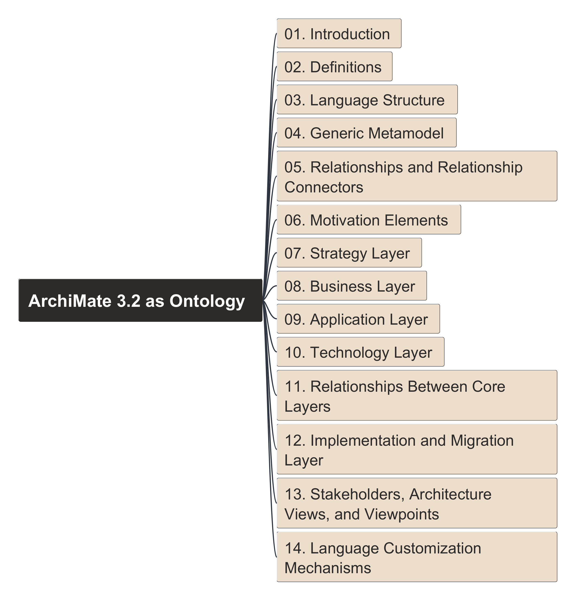
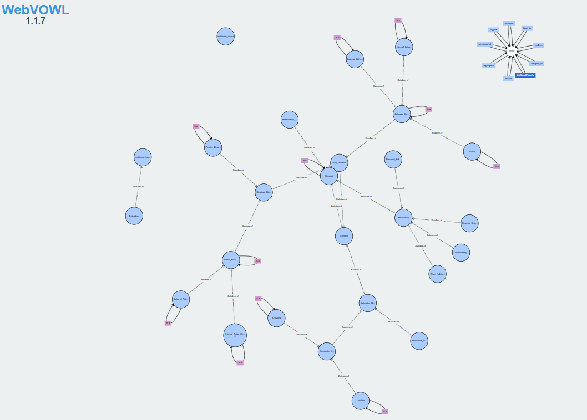
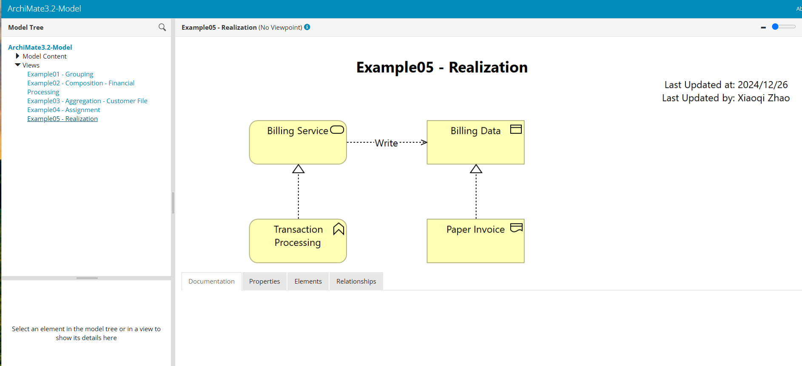

# Build ArchiMate 3.2 Ontology

Build ontology view step-by-step on ArchiMate 3.2 Specification

<!-- <image src="img/ArchiMate_3.2_as_Ontology.png" alt="archimate 3.2" width=500> -->

Here to view mindmap in [Markdown format](./ArchiMate_3.2_as_Ontology.md).

Here to view mindmap in [HTML format](./ArchiMate_3.2_as_Ontology.html)

## Tools used during the demo

Protege, Archi, FreePlane, VS Code, MS PointPoint

## Visualize your RDF Ontology

### Tool 1: [RDF-Grapher](https://www.ldf.fi/service/rdf-grapher)

- From formate: RDF/XML
- To format: PNG
- Send from as HTTP POST (needed for large RDF data): checked

Paste the RDF content into the field and click `Visualize` button, you may get below visual (using 026 as example):

<!-- <image src="img/rdf-grapher/ontology-026.png" alt="Sample Export from Ontology 026" width=800> -->

### Tool 2: WebVOWL

You can deploy that in your local web server.

<!-- <image src="img/webvowl/webvowl-026.png" alt="Sample Export from Ontology 026" width=800> -->

## Archi Model's HTML Report

Click [here](archi_report/index.html) to view the export HTML report. (note: you need to be in the GitHub Page, or clone repository to your local).

Below is the sample screen base on video 027 snapshot:

<!-- <image src="img/archi/archi-html-report-027.png" alt="archi-html-report-027" width=800> -->

# About the Course and Videos

The course is publishing in Udemy first, which can be accessed [here - Build Ontology View with ArchiMate 3.2 Specification](https://www.udemy.com/course/build-ontology-view-with-learning-archimate/?referralCode=6A3B23ADD67551B38D2B), and later also shared in [YouTube 
channel](https://www.youtube.com/playlist?list=PL6DEHvciXKeUWWe--FiiSIyga0vt3kBpI), keep updating.

Any questions, welcome to raise in Discussion Board. (2024~2026)