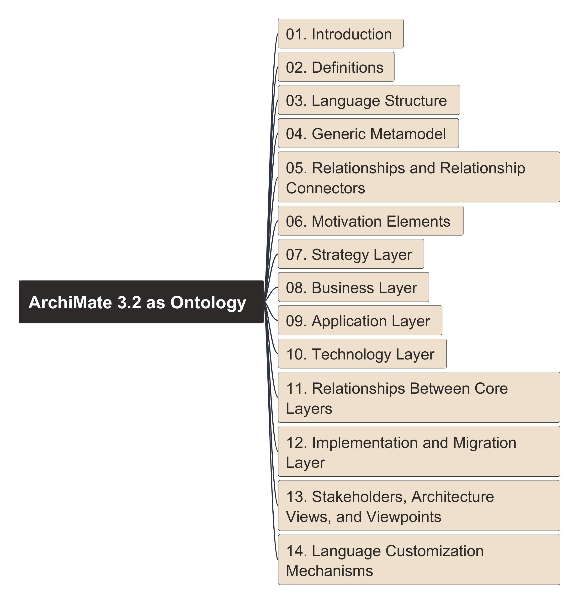
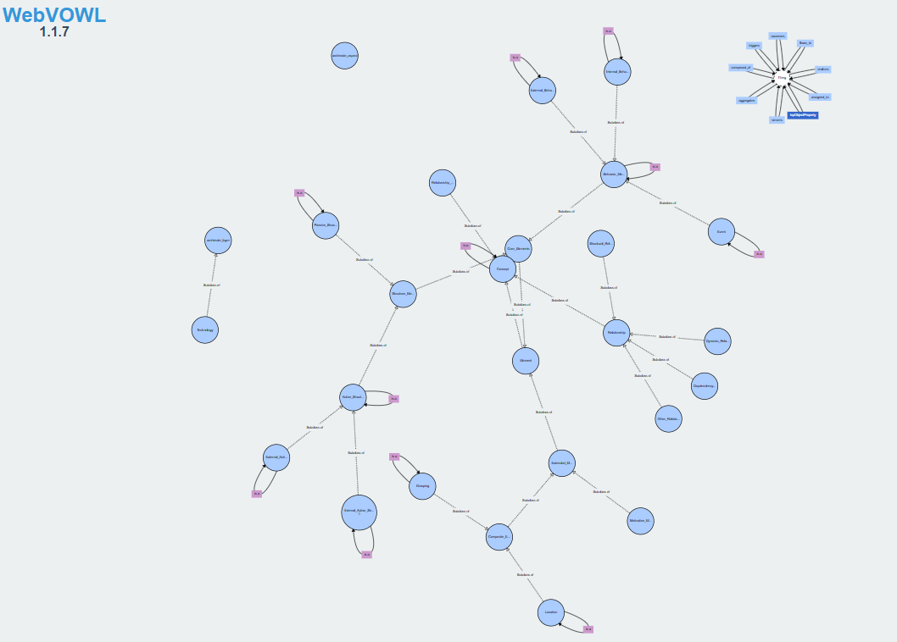

# ArchiMate 3.2 Ontology: A Combined Knowledge Investigation

Welcome to the **ArchiMate 3.2 Ontology** repository. This project is a specialized investigation into the intersection of **ArchiMate** (the Open Group's leading modeling language for Enterprise Architecture) and **Ontology** (the foundation of semantic knowledge representation).

---

## 🏆 Featured & Recognized Learning Content

### **Udemy Bestseller & Udemy Business Selection**
This project serves as the foundation for a **Bestselling course on Udemy**. It has been officially selected for the **Udemy Business** collection, making it a trusted resource for enterprise architects and organizations worldwide.

### 🚀 Get the Full Course
For the most comprehensive, well-packaged learning experience—including structured lessons, hands-on demos, and deep-dive explanations—enroll in the full course:

👉 **[Build Ontology View with ArchiMate 3.2 Specification](https://www.udemy.com/course/build-ontology-view-with-learning-archimate/?referralCode=6A3B23ADD67551B38D2B)**

### 🎥 Free Community Resources
I am also committed to sharing this knowledge with the community. You can access the video playlist for this investigation for free on my YouTube channel:

📺 **[ArchiMate Ontology Video Series - YouTube](https://www.youtube.com/playlist?list=PL6DEHvciXKeUWWe--FiiSIyga0vt3kBpI)**

---

## 🔍 Why This Knowledge Base?

For anyone looking to **deep dive into the ArchiMate 3.2 Specification**, this repository and the accompanying course are a **must-taken knowledge base**.

By treating the ArchiMate specification through the lens of Ontology, we move beyond simple diagramming to achieve:
- **Semantic Precision:** Structured understanding of ArchiMate relationships and elements.
- **Advanced Modeling:** Building knowledge graphs that represent architecture as data.
- **Tool Mastery:** Leveraging tools like **Protege**, **Archi**, **FreePlane**, and **RDF-Grapher** to visualize and validate architecture.

---

## 🖼️ Key Content & Visualizations

### ArchiMate Ontology Mindmap

### RDF Graph Visualization by [RDF-Grapher](https://www.ldf.fi/service/rdf-grapher)

- From formate: RDF/XML
- To format: PNG
- Send from as HTTP POST (needed for large RDF data): checked

Paste the RDF content into the field and click `Visualize` button, you may get below visual (using 026 as example):

<!-- <image src="img/rdf-grapher/ontology-026.png" alt="Sample Export from Ontology 026" width=800> -->

### Visualization from WebVOWL

You can deploy that in your local web server, below is Sample Export from Ontology 026.

<!-- <image src="img/webvowl/webvowl-026.png" alt="Sample Export from Ontology 026" width=800> -->

---

## 🛠️ Tools & Methodology
This investigation utilizes a professional-grade toolset to bridge the gap between EA modeling and Semantic Web technologies:
- **Protege:** For OWL ontology modeling.
- **Archi:** For ArchiMate modeling practices.
- **SPARQL:** For querying the architectural knowledge base.
- **RDF/XML:** For data serialization and interoperability.

---

## 🌐 Connect & Collaborate

I invite you to visit my homesite at **[xiaoqi.com](https://xiaoqi.com)** to explore more insights and join the conversation on:
- **Enterprise Architecture (EA)**
- **Architectural Modeling Patterns**
- **Semantic Knowledge Management**

Feel free to share your comments and feedback. Let's build better architectures together!

> **"Learning is the journey, not destination!"**

---

*© 2024-2026 Yasen (Xiaoqi Zhao). All rights reserved.*