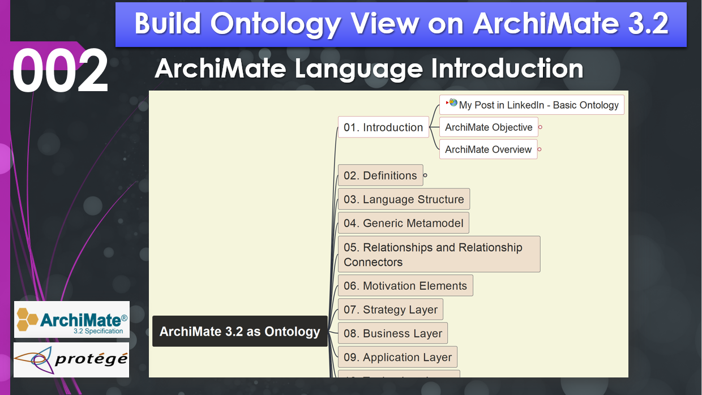

# Chapter 01 (Lecture 002) | Introduction – Objectives and Scope of ArchiMate 3.2

- [Chapter 01 (Lecture 002) | Introduction – Objectives and Scope of ArchiMate 3.2](#chapter-01-lecture-002--introduction--objectives-and-scope-of-archimate-32)
  - [2.1 The Roadmap of the Specification](#21-the-roadmap-of-the-specification)
  - [2.2 Core Objectives of ArchiMate](#22-core-objectives-of-archimate)
    - [1. A Standard for Enterprise Architecture Modeling](#1-a-standard-for-enterprise-architecture-modeling)
    - [2. Standardized Entity and Relationship Iconography](#2-standardized-entity-and-relationship-iconography)
    - [3. The Open Exchange Ecosystem (XML)](#3-the-open-exchange-ecosystem-xml)
  - [2.3 Philosophical Alignment: Classes vs. Individuals](#23-philosophical-alignment-classes-vs-individuals)

In this chapter, we begin our deep dive into the formal ArchiMate 3.2 specification, focusing on the core objectives and the high-level structure of the language. Understanding the "why" behind the language is essential before we begin constructing our ontology in Protégé.

## 2.1 The Roadmap of the Specification

The ArchiMate 3.2 specification is structured to provide a logical progression from general concepts to specific architectural layers. Our journey through this book (and the accompanying ontology) will follow this sequence:

1. **Introduction & Objectives**: (This chapter)
2. **Language Structure**: Defining the foundational syntax.
3. **Generic Meta-Model**: Establishing the high-level classes for our ontology.
4. **Relationships**: Modeling how different elements interact.
5. **Core Layers**: Business, Application, and Technology.
6. **Extended Layers**: Strategy, Motivation, Implementation, and Migration.
7. **Views and Viewpoints**: Customizing how architecture is communicated.

## 2.2 Core Objectives of ArchiMate

The Open Group defines three primary objectives for the ArchiMate language, which serve as the North Star for any Enterprise Architect:

### 1. A Standard for Enterprise Architecture Modeling

ArchiMate is designed as a visual language to describe, analyze, and communicate architecture.

- **Analysis**: It provides a structured way to evaluate the impact of changes.

- **Communication**: It bridges the gap between various stakeholders (from CEOs to developers) by providing a common set of symbols.

- **Visualization**: It turns complex organizational data into clear, standardized diagrams.

### 2. Standardized Entity and Relationship Iconography

The language provides a fixed set of entities (elements) and relationship types, each with its own "iconography" or notation. For example:

- A **Business Actor** represents an entity capable of performing behavior.

- An **Assignment Relationship** (visualized as a solid line with a filled circle at the start) indicates that an actor is performing a specific process.

By using these standard notations, you eliminate the need for extensive text-based explanations; the diagram speaks for itself to anyone trained in the language.

### 3. The Open Exchange Ecosystem (XML)

ArchiMate is tool-agnostic. To ensure portability, the standard includes the **Open Exchange Format**. This XML-based format allows you to export a model from an open-source tool like **Archi** and import it into commercial platforms.

As demonstrated in the demo, the XML structure breaks a model down into four key components:

1. **Elements**: The "nouns" of your model (e.g., Business Actor, Process).

2. **Relationships**: The "verbs" connecting elements (e.g., Assignment, Association).

3. **Organizations**: The logical grouping or folder structure of the model.

4. **Views**: The actual diagrams and layouts.

## 2.3 Philosophical Alignment: Classes vs. Individuals

As we transition to building our ontology in Protégé, we must address a critical distinction: **Classes vs. Individuals**.

- **Classes (The Meta-Model)**: In our ontology, "Business Actor" or "Business Process" are classes. They define the type of thing that can exist. This is analogous to a "Class" in Object-Oriented Programming (OOP) like Java or Python.

- **Individuals (The Model)**: A specific person (e.g., "John Doe") or a specific process (e.g., "Invoice Processing") is an individual (an instance of a class).

In this book, we are primarily modeling the **ArchiMate Meta-Model**. This means we are creating an ontology of the classes defined by the specification, ensuring the logic of the language itself is sound before applying it to specific enterprise data.

For those following the hands-on demo, you can find the sample [`ArchiMate3.2-Model.xml`](../../archimodel_open-exchange-format/ArchiMate3.2-Model.xml) Open Exchange file example in the [ArchiMate_Ontology GitHub Repository](https://github.com/yasenstar/ArchiMate_Ontology) to inspect the underlying XML structure yourself.

---

This page is last updated at 2026-04-01