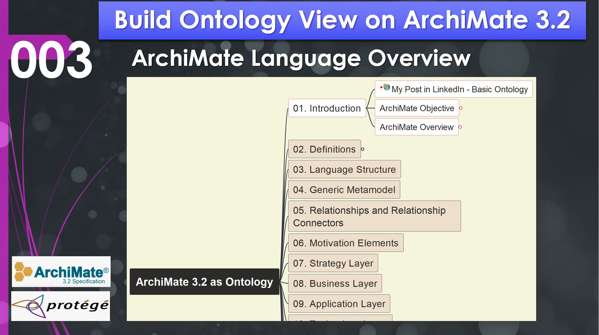
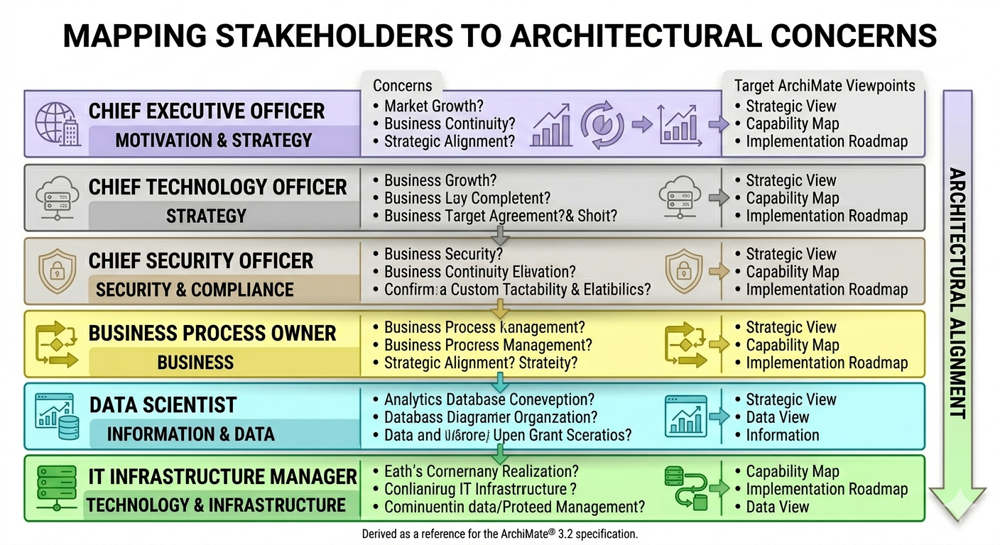
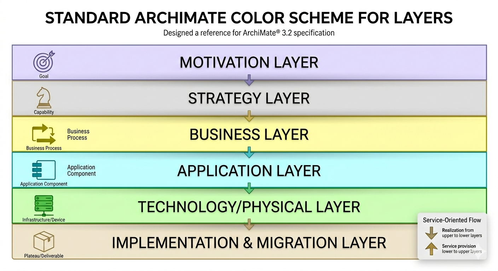

# Chapter 01 (demo 003): Introduction – Enterprise Architecture Overview and Stakeholders

- [Chapter 01 (demo 003): Introduction – Enterprise Architecture Overview and Stakeholders](#chapter-01-demo-003-introduction--enterprise-architecture-overview-and-stakeholders)
  - [3.1 The Role of the Stakeholder](#31-the-role-of-the-stakeholder)
  - [3.2 The Architect’s Toolkit](#32-the-architects-toolkit)
  - [3.3 Standardization and Customization](#33-standardization-and-customization)

In this chapter, we conclude our introductory overview of the ArchiMate® 3.2 language by examining the broader context of Enterprise Architecture (EA) and the roles of the individuals who utilize it.

## 3.1 The Role of the Stakeholder

An Enterprise Architecture is typically developed because key individuals — **Stakeholders** — have concerns that need to be addressed by the organization's business or IT systems. It is a common misconception that EA is strictly an IT function. In reality, the scope of EA is the **entire Enterprise**.

**Internal vs. External Stakeholders**

While external customers are vital for revenue, internal stakeholders are equally critical as "enabling functions." As an architect, your primary task is to:

1. **Identify Stakeholders**: Who are your "talking partners"?

2. **Gather Motivations**: What are their goals and strategies?

3. **Address Concerns**: Use ArchiMate to visualize and balance these concerns through architecture views.

## 3.2 The Architect’s Toolkit

Without a holistic framework like ArchiMate, it is unlikely that all requirements will be consistently addressed. ArchiMate provides a uniform representation for diagramming that helps architects:

- **Abstract Reality**: One of the most critical skills for an EA is the ability to take a complex real-world situation and abstract it into meaningful elements (e.g., turning a specific employee's task into a "Business Process" performed by a "Business Actor").

- **Layered Modeling**: ArchiMate uses a service-oriented approach to distinguish between layers:

  - **Strategy Layer**: Higher-level goals and capabilities.

  - **Business Layer**: Processes and actors (typically yellow).

  - **Application Layer**: Software components and services (typically blue).

  - **Technology/Physical Layer**: Infrastructure and hardware (typically green/brown).

- **Viewpoints**: These allow you to "filter" the model to focus on what matters to a specific stakeholder. For example, an "Application Cooperation" viewpoint might hide detailed infrastructure to focus on how software systems interact.

This image integrates the precise color scheme from the official ArchiMate Standard preferences file into the original layered diagram. I have updated the specific hex codes for each band:

- Motivation (Purple): Corrected to a distinct lavender/purple shade.
- Strategy (Blue/Cyan): Standardized to a light sky-blue.
- Business (Yellow): Applied the specific light yellow defined by the standard.
- Application (Green): Updated to the exact pale green specified.
- Technology (Blue-Grey/Brown): This band has been updated to the specific neutral blue-grey/beige tone used for the Infrastructure layer.
- Physical (Brown/Grey): This layer now correctly uses the standard's grey/brown palette.

**ArchiMate 3.2 Standard Layer HEX Codes**:

| Layer | HEX Code |	Color Category |
| --- | --- | --- |
| Motivation Layer |	#F2E6FF	| Pale Lavender |
| Strategy Layer |	#F1F8FF	| Pale Blue |
| Business Layer |	#FFFFC5	| Pale Yellow |
| Application Layer |	#E5F5FF	| Pale Sky Blue |
| Technology Layer |	#D4F6CC	| Pale Green |
| Physical Layer |	#F1F0E0	| Pale Beige/Grey |
| Implementation & Migration |	#FFE0E0	| Pale Pink |

**Structural & Special Element HEX Codes**:

| Element Type | HEX Code | Color Category |
| --- | --- | --- |
| Group Element | #F8F8F8 | Light Grey |
| Location Element | #FFE0C0 | Light Tan/Orange |

For Archi tool's default element color code, check here https://www.archimatetool.com/downloads/colour-schemes/ArchiMate%20Standard%20-%203.2.prefs

## 3.3 Standardization and Customization

While ArchiMate provides a standard "iconography," it remains flexible. Tools like **Archi** allow for customization of color schemes if your organization has specific internal standards. However, it is generally recommended to stick to the community standards (Yellow for Business, Blue for Application, Green for Technology) to ensure your models are easily understood by the wider professional community.

**Terminology Matters**

The specification also defines strict terminology that dictates how architects should interpret the language:

- **Shall**: Indicates a mandatory requirement.

- **Should**: Indicates a recommendation.

- **May**: Indicates an optional feature.

By adhering to these rules, architects ensure that their "visual stories" are consistent, logical, and transferable across different tools and organizations.

---

Next, we will move into Chapter 2 of the specification: Language Definitions, where we begin to formalize the terminology we've discussed today into our ontology.

---

This page is last updated at 2026-04-01