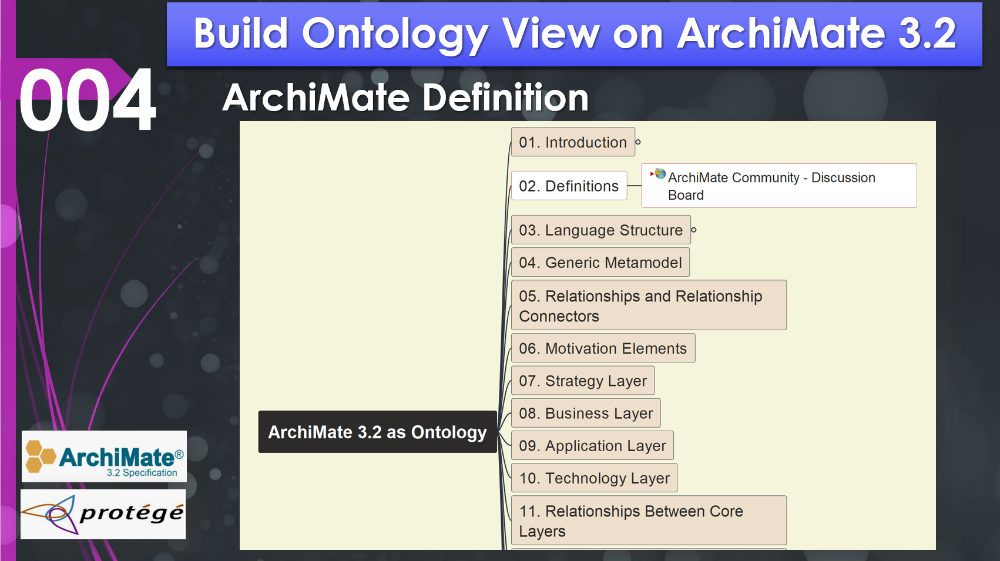

# Chapter 02 (demo 004) | Foundations—Definitions and the ArchiMate Community

- [Chapter 02 (demo 004) | Foundations—Definitions and the ArchiMate Community](#chapter-02-demo-004--foundationsdefinitions-and-the-archimate-community)
  - [2.1 The Specification Prerequisites](#21-the-specification-prerequisites)
  - [2.2 The ArchiMate Core Framework](#22-the-archimate-core-framework)
  - [2.3 Essential Modeling Definitions](#23-essential-modeling-definitions)
  - [2.4 The ArchiMate Community](#24-the-archimate-community)
  - [Chapter Summary](#chapter-summary)

Before diving into the complexities of structural and behavioral modeling, an architect must master the vocabulary of the language. ArchiMate 3.2 is not merely a collection of shapes; it is a formal specification with strict definitions designed to ensure consistency across global enterprises.

In this chapter, we establish the "Prerequisites of Understanding"—the key terms, the framework’s structure, and where to turn when the documentation isn't enough.

## 2.1 The Specification Prerequisites

When working with ArchiMate, it is essential to recognize its position within the broader Enterprise Architecture (EA) ecosystem. The specification explicitly points to two primary references for terminology:

1. The TOGAF® Standard: For any term related to the practice of Enterprise Architecture itself (e.g., "Architecture Development Method" or "Stakeholder"), the TOGAF framework is the definitive source.

2. Merriam-Webster’s Collegiate Dictionary: For any English word not specifically defined in the ArchiMate or TOGAF standards, this dictionary serves as the baseline for interpretation.

**Pro-Tip for Certification**: If you are preparing for the ArchiMate Practitioner exam, having a foundational understanding of TOGAF (specifically the ADM) provides the necessary context for why certain ArchiMate layers exist.

## 2.2 The ArchiMate Core Framework

The "Core Framework" is the backbone of the language. It is a matrix that classifies elements based on their **Layers** and **Aspects**.

**The Three Layers**

- **Business Layer**: Focuses on products, services, and the internal business processes of the organization.
- **Application Layer**: Covers the software applications that support the business and the data they manage.
- **Technology Layer**: Describes the hardware, software platforms, and communication networks required to run applications.

**The Three Aspects**

While the layers move vertically, the aspects categorize elements horizontally:

- **Active Structure**: The "who" or "what" that performs behavior (e.g., a Business Actor or Application Component).
- **Behavior**: The "how" the work is done (e.g., a Process or Function).
- **Passive Structure**: The "objects" upon which behavior is performed (e.g., a Data Object or Business Object).

## 2.3 Essential Modeling Definitions

To build a precise meta-model, you must distinguish between these fundamental concepts:

**View vs. Viewpoint**

An **Architecture View** is what you actually create—the diagram itself. It is a representation of a system from the perspective of a related set of concerns. An Architecture Viewpoint, however, is the "template" or "angle" from which you look. If you are focusing only on how applications realize business processes, your viewpoint dictates which elements are visible and which are "grayed out."

**Elements and Relationships**

- **Element**: The basic unit in the ArchiMate meta-model (e.g., a "Business Collaboration" node).
- **Relationship**: The connection between a Source and a Target. Even "Association" links, which appear as plain lines, have an underlying direction in the model’s XML data.
- **Relationship Connector**: A tool used to facilitate "one-to-many" or "many-to-many" junctions in your diagrams.

**Attributes and Properties**

In tools like **Archi**, every element has standard **Attributes** (like Name and Documentation). However, you can extend these using **Properties**—key-value pairs (e.g., Lifecycle Status: Deprecated) that allow you to store metadata for analysis and reporting.

## 2.4 The ArchiMate Community

Architecture is a collaborative discipline. Beyond the official Open Group documentation, the **ArchiMate Community** is a vital resource for practitioners.

- **GitHub and Issue Tracking**: Many open-source initiatives and tool-specific plugins (like jArchi scripts) are managed through GitHub. Engaging with these communities allows you to see live issues and contribute to the evolution of modeling patterns.

- **ArchiMate 101**: For those new to the language, the community-driven "101" working groups provide free introductory materials and discussion boards to clarify complex modeling scenarios.

## Chapter Summary

Understanding the Core Framework's 3x3 matrix is the first step toward professional modeling. By distinguishing between Active Structure, Behavior, and Passive Structure across the Business, Application, and Technology layers, you create a logical map that ensures your architecture is both readable and technically sound.

*In the next chapter, we will explore the **Language Structure** in depth, breaking down how these elements connect to form a cohesive enterprise story.*

---

This page is last updated at 2026-04-05