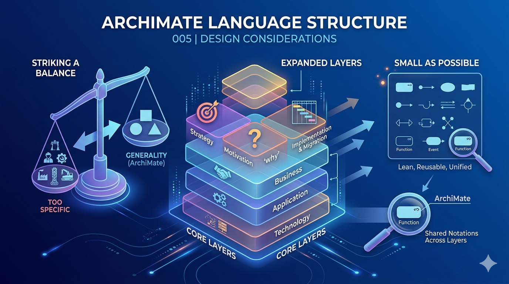

# Chapter 3 (Lecture 005) | Language Structure: Design Considerations

In this chapter, we delve into the foundational logic behind the ArchiMate language. Before mastering the individual elements and relationships, it is crucial to understand the "why" and "how" of its design. The structure of ArchiMate 3.2 is not arbitrary; it is a carefully balanced framework designed to address specific challenges in Enterprise Architecture (EA).

- [Chapter 3 (Lecture 005) | Language Structure: Design Considerations](#chapter-3-lecture-005--language-structure-design-considerations)
  - [3.1 Design Considerations](#31-design-considerations)
  - [3.2 The Information \& Data Gap](#32-the-information--data-gap)
  - [Key Takeaways](#key-takeaways)

## 3.1 Design Considerations

The ArchiMate language is built upon several core design considerations that ensure its effectiveness as a general-purpose modeling language for enterprises.

1. **Striking a Balance: Generality vs. Specificity**

One of the primary challenges in developing a general meta-model is finding the "sweet spot" between being too broad and too specific.

- Industry Agnostic: ArchiMate does not provide a specific meta-model for a single industry (e.g., manufacturing, finance, or defense). Instead, it provides a generic framework that can be adapted to any domain.

- Reference Frameworks: Just as TOGAF provides a general architecture framework, ArchiMate provides the language. Specialized domains—like the US Department of Defense (DoAF)—often build their own reference frameworks, but the "shadow" of ArchiMate’s generic concepts can often be found within them [02:41].

2. **Evolution Through Layering**

ArchiMate has evolved step-by-step based on the real-world needs of architects.

- **The Core**: Early versions focused primarily on the "Core" layers: Business, Application, and Technology [04:02].

- **Expansion**: As the practice of EA matured, the language expanded to include Strategy, Motivation, and Implementation & Migration layers [04:28].

- **The Modern Challenge**: In version 3.2, the focus has shifted toward abstraction and consolidation. For instance, the language uses similar shapes (notations) for concepts like "Functions" or "Events" across different layers [05:44]. While some argue this adds complexity, the goal is to serve the stakeholder by providing a unified communication tool.

3. **The "Small as Possible" Restriction**

A critical design restriction of ArchiMate is its commitment to being a **lean language**.

- **Minimalism**: Much like the English alphabet consists of only 26 letters, ArchiMate utilizes a small set of approximately 30-40 notations and 11 relationship types [09:13].

- **Usability**: Despite this small "vocabulary," the language is powerful enough to model incredibly complex systems. In professional practice, repositories containing over 30,000 elements and relationships are successfully managed using this limited set of notations [10:20].

## 3.2 The Information & Data Gap

A recurring debate within the ArchiMate community involves the "Information Layer." While ArchiMate covers Business, Application, and Technology well, some architects feel the need for a more dedicated Data Architecture layer.

Currently, ArchiMate chooses to remain at a higher level of abstraction. The design consideration here is whether to:

1. **Extend the language** to cover detailed data modeling.

2. **Limit the language** to maintain its "small as possible" footprint, leaving detailed data modeling to specialized tools while ArchiMate provides the high-level landscape [13:51].

## Key Takeaways

- ArchiMate is designed to be **generic and industry-independent**.

- It prioritizes a **small, reusable set of notations** over a massive library of specific symbols.

- It acts as a **communication tool** between architects and stakeholders across different layers of the enterprise.

In the next chapter (006), we will move from design considerations to the actual Top-Level Language Structure and the specific layers of the ArchiMate framework.

---

*Video Reference: Build Ontology on ArchiMate - 005 3. Structure 3.1 Design Consideration*