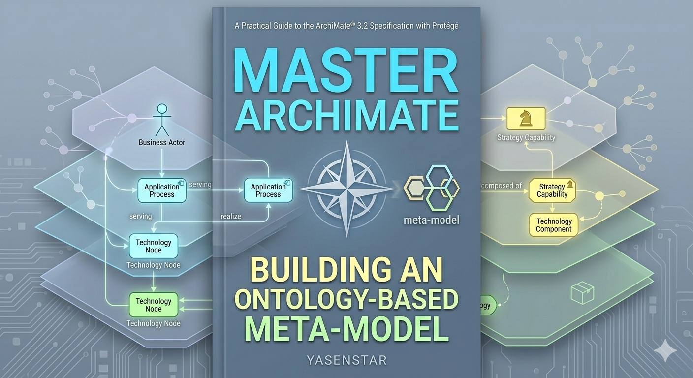

# ArchiMate in Ontology

Table of Contents

Chapter 01: Introduction

- [Demo 001: Introduction – The Vision for an Ontology-Based ArchiMate Meta-Model](./001-010/001.md)
- [Demo 002: Introduction – Objectives and Scope of ArchiMate 3.2](./001-010/002.md)
- [Demo 003: Introduction – Enterprise Architecture Overview and Stakeholders](./001-010/003.md)

Chapter 02: Definitaion

- [Demo 004: Foundations—Definitions and the ArchiMate Community](./001-010/004.md)

---

© Copyright, Xiaoqi Zhao, 2026